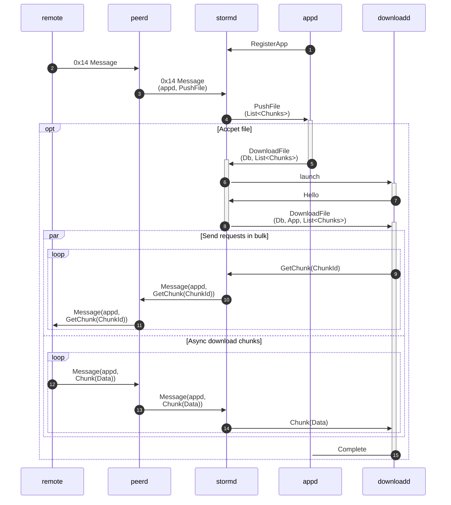

```mermaid
sequenceDiagram

autonumber

participant remote
participant peerd
participant stormd
participant appd
participant downloadd

appd ->> stormd: RegisterApp

remote ->> peerd: 0x14 Message
peerd ->> stormd: 0x14 Message<br>(appd, PushFile)
stormd ->> +appd: PushFile<br>(List<Chunks>)

opt Accpet file
appd ->> +stormd: DownloadFile<br>(Db, List<Chunks>)
deactivate appd
stormd ->> +downloadd: launch
downloadd ->> -stormd: Hello
stormd ->> +downloadd: DownloadFile<br>(Db, App, List<Chunks>)
deactivate stormd
par Send requests in bulk
    loop
        downloadd ->> stormd: GetChunk(ChunkId)
        stormd ->> peerd: Message(appd, <br>GetChunk(ChunkId))
        peerd ->> remote: Message(appd, <br>GetChunk(ChunkId))
    end
and Async download chunks
    loop
        remote ->> peerd: Message(appd, <br>Chunk(Data))
        peerd ->> stormd: Message(appd, <br>Chunk(Data))
        stormd ->> downloadd: Chunk(Data)
    end
end
downloadd -> +appd: Complete
deactivate downloadd
end

```
